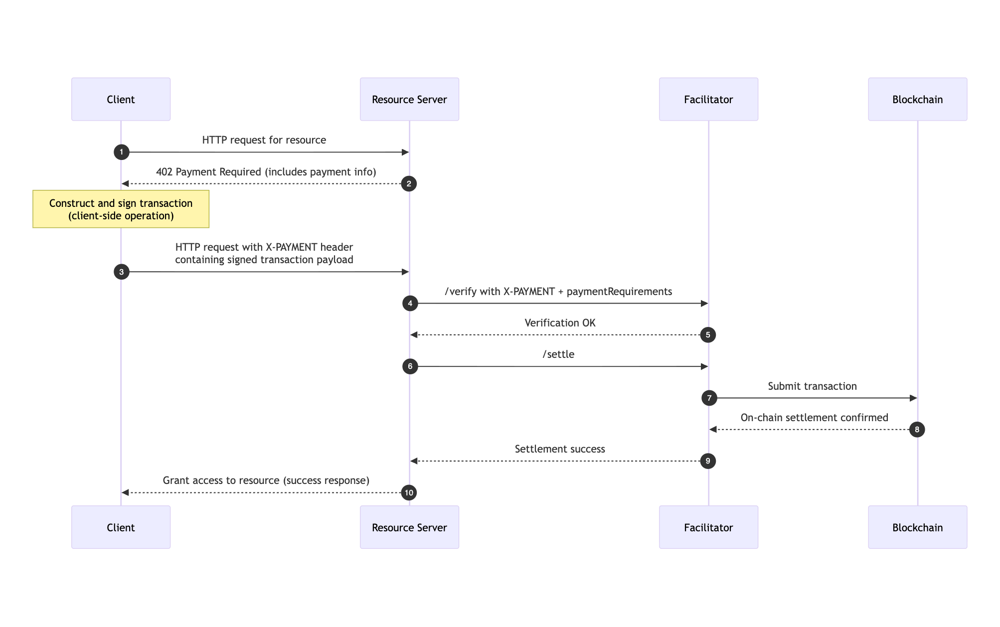

# Scheme: exact on Cardano

## Summary

This document specifies the `exact` payment scheme for the x402 protocol on Cardano. This scheme facilitates payments of Cardano Native Tokens.

It offers two ways to do x402 interactions:

a) Doing **Address-To-Address** Payments, similar to the regular x402 specifications on other chains.
b) Using the **Masumi Smart Protocol**, which offers additional refund mechanics & decision logging mechanisms in a decentralised way.

## Protocol Flow




The protocol flow for `exact` on Cardano is client-driven. 

1.  **Client** makes an HTTP request to a **Resource Server**.
2.  **Resource Server** responds with a `402 Payment Required` status. Detailing the Payment Information 
3.  **Client** constructs transaction body & returns it to Ressource Server.
4.  **Resource Server** receives the request and forwards the `X-PAYMENT` header and `paymentRequirements` to a **Facilitator's** `/verify` endpoint to check if the transaction is valid.
5.  **Facilitator** confirms, then **Resource Server** sends the request to the **Facilitator** `/settle` endpoint.
6.  **Facilitator** submits the transaction.
7. Upon successful on-chain settlement, the **Facilitator** responds to the **Resource Server**.
8. **Resource Server** grants the **Client** access to the resource in its response.

## Version 1: Address-To-Address

### `PaymentRequirementsResponse`

```json
{
  "x402Version": 1,
  "error": "X-PAYMENT header is required",
  "accepts": [
    {
      "scheme": "exact",
      "network": "cardano-mainnet",
      "maxAmountRequired": "10000", // 1 USDM = 1000000000
      "asset": "c48cbb3d5e57ed56e276bc45f99ab39abe94e6cd7ac39fb402da47ad", // USDM on Cardano Mainnet - use 16a55b2a349361ff88c03788f93e1e966e5d689605d044fef722ddde for USDM on Preprod
      "payTo": "addr1...",
      "resource": "https://api.example.com/premium-data",
      "description": "Access to premium market data",
      "mimeType": "application/json",
      "outputSchema": null,
      "maxTimeoutSeconds": 600, // Has to be set to a higher amount of time because of the Cardano Network speed
      "extra": {
      }
    }
  ]
}
```

### `X-PAYMENT` Header Payload

The X-PAYMENT header is base64-encoded and sent in the client's request to the resource server when paying for a resource.

The payload field of the X-PAYMENT header must contain the following fields:

transaction: The Base64 encoded Cardano transaction.
Example:

```json
{
  "transaction": "AAAIAQDi1HwjSnS6M+WGvD73iEyUY2FRKNj0MlRp7+3SHZM3xCvMdB0AAAAAIFRgPKOstGBLCnbcyGoOXugUYAWwVzNrpMjPCzXK4KQWAQCMoE29VLGwftex8rhIlOuFLFNfxLIJlHqGXoXA8hx6l+LMdB0AAAAAIHbPucTRIEWgO6lzqukswPZ6i72IHEKK5LyM1l9HJNZNAQBthSeHDVK8Xr5/zp3JMZPLtG5uAoVgedTA4pEnp+h8qUlUzRwAAAAAIACH0swYW/QfGCFczGnjAVPHPqZrQE5vfvJr36i6KVEFAQAC7W4K5vCwB+nprjxcNlLiOQ7SIIfyCZjmj2qSis2iTsCuzBwAAAAAIAkSUkXOoeq52GNdhwpbs+jZqqrqPdmiN3oPw5EzDIanAQAIyFNGWD6OxiFIyXSxrNEcFG0npm+nImk6InUssXb1EZgx1hwAAAAAILhsjmMKyM0n75Cd7z6ufH2LNhOMibFOGhNlLgV5RFuEAQC+Mh4kGkLwrw/11729oUQnt3xOmOreE6PcnuN6M68ZBcCuzBwAAAAAIO2PQhSSqSAawCbRr005lfjBgFOqIHo4zb2GcQ/WCxAlAAgA+QKVAAAAAAAgjiAHD0X4HNSdVPpJtf2E6W2uRc8kbvCHYkgEQ1B+w1MDAwEAAAUBAQABAgABAwABBAABBQACAQAAAQEGAAEBAgEAAQcAHrfFfj8r0Pxsudz/0UPqlX5NmPgFw1hzP3be4GZ/4LEB5XXrONxGw0qOUsq3yNKeUhOCOgCIwaa4pswKaer66EKqPGwdAAAAACBrOIN4poutFUmHfB6FbFJu8GgXoPPTGQWREqFpPfvO1B63xX4/K9D8bLnc/9FD6pV+TZj4BcNYcz923uBmf+Cx7gIAAAAAAABg4xYAAAAAAAA="
}
```

Full X-PAYMENT header:

```json
{
  "x402Version": 1,
  "scheme": "exact",
  "network": "cardano",
  "payload": {
    "transaction": "AAAIAQDi1HwjSnS6M+WGvD73iEyUY2FRKNj0MlRp7+3SHZM3xCvMdB0AAAAAIFRgPKOstGBLCnbcyGoOXugUYAWwVzNrpMjPCzXK4KQWAQCMoE29VLGwftex8rhIlOuFLFNfxLIJlHqGXoXA8hx6l+LMdB0AAAAAIHbPucTRIEWgO6lzqukswPZ6i72IHEKK5LyM1l9HJNZNAQBthSeHDVK8Xr5/zp3JMZPLtG5uAoVgedTA4pEnp+h8qUlUzRwAAAAAIACH0swYW/QfGCFczGnjAVPHPqZrQE5vfvJr36i6KVEFAQAC7W4K5vCwB+nprjxcNlLiOQ7SIIfyCZjmj2qSis2iTsCuzBwAAAAAIAkSUkXOoeq52GNdhwpbs+jZqqrqPdmiN3oPw5EzDIanAQAIyFNGWD6OxiFIyXSxrNEcFG0npm+nImk6InUssXb1EZgx1hwAAAAAILhsjmMKyM0n75Cd7z6ufH2LNhOMibFOGhNlLgV5RFuEAQC+Mh4kGkLwrw/11729oUQnt3xOmOreE6PcnuN6M68ZBcCuzBwAAAAAIO2PQhSSqSAawCbRr005lfjBgFOqIHo4zb2GcQ/WCxAlAAgA+QKVAAAAAAAgjiAHD0X4HNSdVPpJtf2E6W2uRc8kbvCHYkgEQ1B+w1MDAwEAAAUBAQABAgABAwABBAABBQACAQAAAQEGAAEBAgEAAQcAHrfFfj8r0Pxsudz/0UPqlX5NmPgFw1hzP3be4GZ/4LEB5XXrONxGw0qOUsq3yNKeUhOCOgCIwaa4pswKaer66EKqPGwdAAAAACBrOIN4poutFUmHfB6FbFJu8GgXoPPTGQWREqFpPfvO1B63xX4/K9D8bLnc/9FD6pV+TZj4BcNYcz923uBmf+Cx7gIAAAAAAABg4xYAAAAAAAA="
  }
}
```

Schema:

```json
{
  "x402Version": 1,
  "scheme": "exact",
  "network": "cardano",
  "payload": {
    "network": "Mainnet | Preprod",
    "sellerVkey": "sdasdqweqwewewewqe",
    "paymentType": "Web3CardanoV1",
    "blockchainIdentifier": "blockchain_identifier",
    "payByTime": "1713626260",
    "submitResultTime": "1713636260",
    "unlockTime": "1713636260",
    "externalDisputeUnlockTime": "1713636260",
    "agentIdentifier": "agent_identifier",
    "inputHash": "9f86d081884c7d659a2feaa0c55ad015a3bf4f1b2b0b822cd15d6c15b0f00a08"
  }
}
```

### `X-PAYMENT-RESPONSE` Header Payload

The `X-PAYMENT-RESPONSE` header is base64-encoded and returned to the client by the resource server.

Once decoded, the `X-PAYMENT-RESPONSE` is a JSON string with the following properties:

Schema:

```json
{
  "success": "true | false",
  "network": "cardano-masumi"
  "transaction": "transaction-id",
}
```

## Version 2: Using Masumi Protocol


### Expanded `PaymentRequirementsResponse` Schema

The PaymentRequirementsResponse has been expanded to include fields in "extra" and must return the information required to create a valid Masumi Smart Contract interaction.

Schema:

```json
{
  "x402Version": 1,
  "error": "X-PAYMENT header is required",
  "accepts": [
    {
      "scheme": "exact",
      "network": "cardano-masumi",
      "maxAmountRequired": "10000",
      "asset": "0x036CbD53842c5426634e7929541eC2318f3dCF7e",
      "payTo": "0x209693Bc6afc0C5328bA36FaF03C514EF312287C",
      "resource": "https://api.example.com/premium-data",
      "description": "Access to premium market data",
      "mimeType": "application/json",
      "outputSchema": null,
      "maxTimeoutSeconds": 60,
      "extra": {
        "identifierFromPurchaser": "aabbaabb11221122aabb",
        "network": "Mainnet | Preprod",
        "sellerVkey": "sdasdqweqwewewewqe",
        "paymentType": "Web3CardanoV1",
        "blockchainIdentifier": "blockchain_identifier",
        "payByTime": "1713626260",
        "submitResultTime": "1713636260",
        "unlockTime": "1713636260",
        "externalDisputeUnlockTime": "1713636260",
        "agentIdentifier": "agent_identifier",
        "inputHash": "9f86d081884c7d659a2feaa0c55ad015a3bf4f1b2b0b822cd15d6c15b0f00a08"
      }
    }
  ]
}
```

### `X-PAYMENT` Header Payload

The X-PAYMENT header is base64-encoded and sent in the client's request to the resource server when paying for a resource.

Schema:

```json
{
  "x402Version": 1,
  "scheme": "exact",
  "network": "cardano",
  "payload": {
    "identifierFromPurchaser": "aabbaabb11221122aabb",
    "network": "Mainnet | Preprod",
    "sellerVkey": "sdasdqweqwewewewqe",
    "paymentType": "Web3CardanoV1",
    "blockchainIdentifier": "blockchain_identifier",
    "payByTime": "1713626260",
    "submitResultTime": "1713636260",
    "unlockTime": "1713636260",
    "externalDisputeUnlockTime": "1713636260",
    "agentIdentifier": "agent_identifier",
    "inputHash": "9f86d081884c7d659a2feaa0c55ad015a3bf4f1b2b0b822cd15d6c15b0f00a08"
  }
}
```

### `X-PAYMENT-RESPONSE` Header Payload

The `X-PAYMENT-RESPONSE` header is base64-encoded and returned to the client by the resource server.

Once decoded, the `X-PAYMENT-RESPONSE` is a JSON string with the following properties:

Schema:

```json
{
  "success": "true | false",
  "network": "cardano-masumi"
  "transaction": "transaction-id",
}
```
